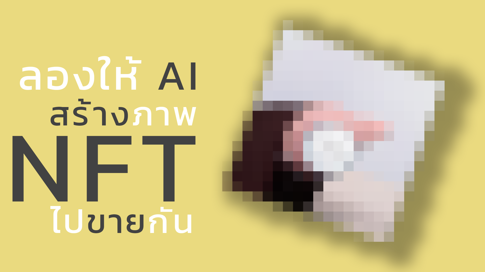
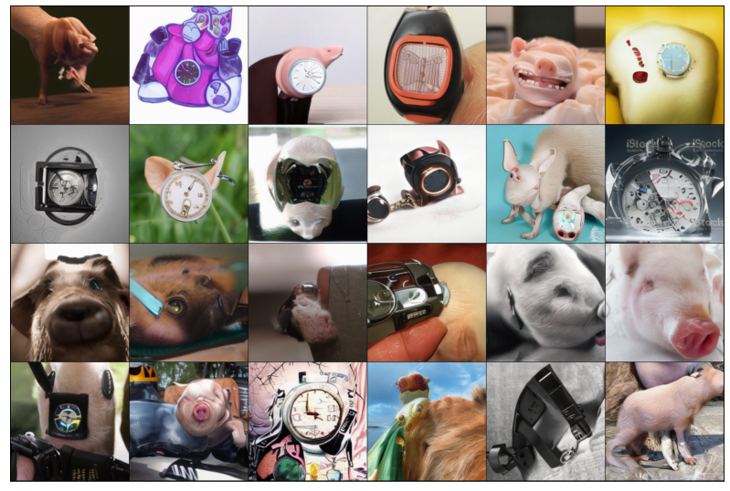
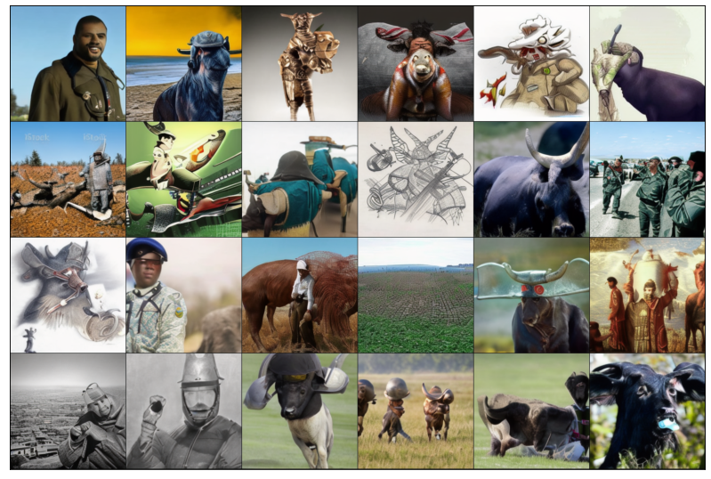
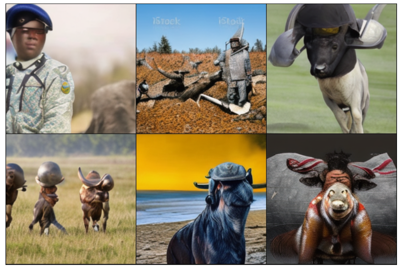
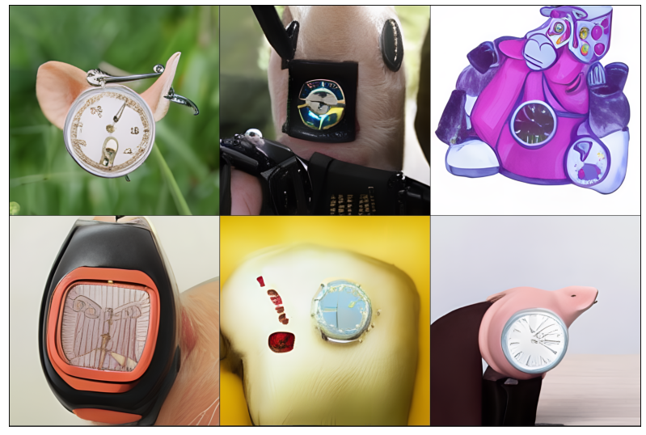
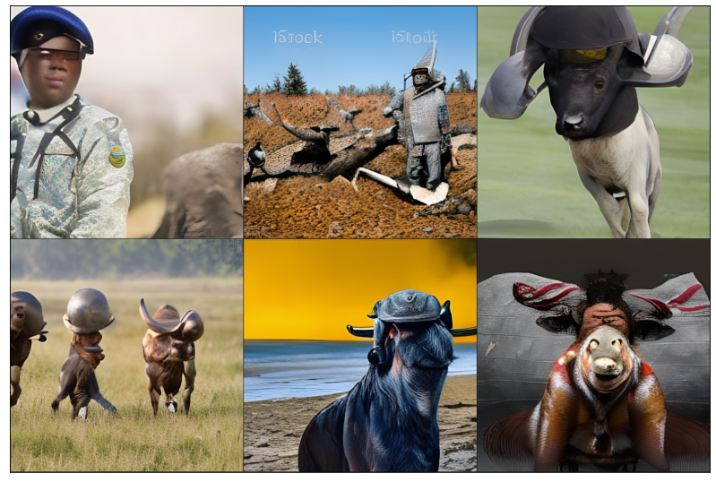

## About AI MAKE NFT

_AI MAKE NFT_ - a project to apply DALL-E model to make NFT art by using ruDALL-E pretrained model.

In this project, I created a script for working on Google Colab in order to use DALL-E to create text-based art. and then sell it on rarible

## Youtube

For more information can be seen in my [video](https://youtu.be/pL4SoZl7-hw) on YouTube.

## Requirements

- Google Colab

## Usage

1. Download [NFT_with_AI.ipynb](https://github.com/TitorPs360/ai-make-nft/blob/main/NFT_with_AI.ipynb)

2. Import to Google Colab

3. Run all cell

4. Input text to input form, support language : `RU`, `EN`, `TH`

5. Wait for output

## Art Result

|          Image Type           |                        Pig                        |                        Buffalo                        |
| :---------------------------: | :-----------------------------------------------: | :---------------------------------------------------: |
|      All Generated Image      |          |          |
|       Top related image       |          |          |
| Top related image (up-scaled) |  |  |
